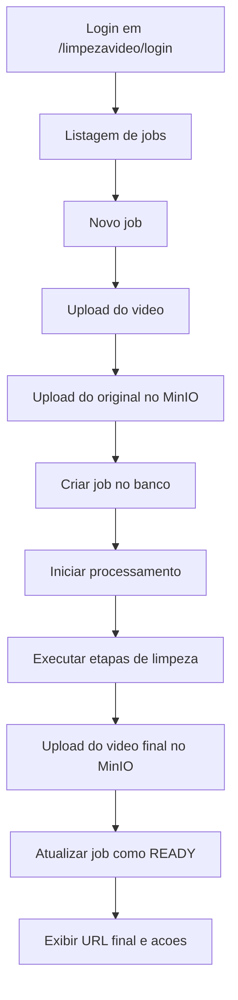

# Escopo do Produto

## Jornada principal

## Resultado esperado para o usuario

- entrar em uma area exclusiva do produto;
- ver um historico dos videos processados;
- clicar em `Novo`;
- enviar um arquivo `.mp4`, `.mov` ou `.webm`;
- acompanhar o andamento;
- abrir a URL final quando o job terminar.

## Regras de negocio do MVP

- cada upload gera um job independente;
- o job sempre guarda referencia do arquivo original e do final;
- o processamento roda automaticamente apos o upload;
- o original nunca e sobrescrito;
- o arquivo final sempre e recodificado;
- falhas devem permitir `tentar novamente`;
- o usuario inicial e unico no MVP, mas a modelagem nao deve impedir multiusuario depois.

## Configuracoes iniciais do pipeline

- sem corte inicial no MVP;
- inserir fechamento visual no final do video com:
  - logo da marca;
  - identificacao do Instagram `@compraesperta.promocoes`;
- audio:
  - modo `preservar`;
  - modo `reduzir`;
  - modo `mutar`;
- saida padrao: `mp4/h264 + aac`;
- resolucao padrao: preservar origem quando possivel;
- estimativa de tempo: baseada em duracao do video e historico simples por minuto processado.

## Decisao importante sobre o audio

A reducao para `5%` nao entra como regra fixa do MVP.

Motivo:

- pode inutilizar o video em casos em que a fala original ainda importa;
- pode gerar uma experiencia ruim sem contexto;
- faz mais sentido tratar isso como configuracao do job.

No MVP, o recomendado e:

- `preservar` por padrao;
- permitir `reduzir para X%`;
- permitir `mutar`.

## Branding de saida no MVP

Para evitar remover parte util do video, o MVP nao deve cortar a abertura por padrao.

Em vez disso, o processamento deve adicionar um fechamento visual no final do video contendo:

- logo enviado pelo usuario;
- texto com o Instagram `@compraesperta.promocoes`.

Observacao de implementacao:

- o logo deve ser tratado como asset configuravel do produto;
- se o arquivo final do logo ainda nao estiver disponivel no repositorio, a implementacao pode seguir com placeholder temporario ate o asset oficial ser anexado.
