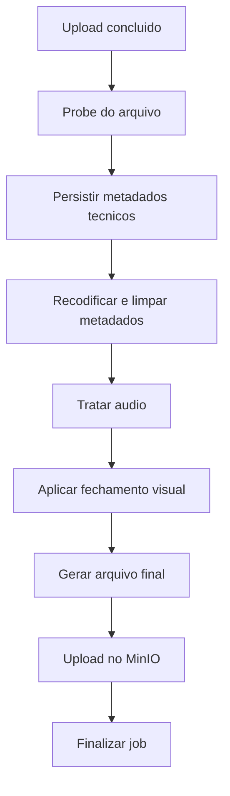

# Pipeline de Processamento

## Objetivo

Padronizar um pipeline de limpeza tecnica de video usando as ferramentas ja existentes e extensoes pequenas onde necessario.

## Pipeline macro

## Etapas detalhadas

### 1. `UPLOAD_ORIGINAL`

- receber o arquivo pelo Next;
- subir o original no MinIO;
- criar o job com status `QUEUED`.

### 2. `PROBE_INPUT`

- coletar duracao, codec, fps, resolucao e tamanho;
- gravar no banco para calculo de ETA;
- falhar cedo se o arquivo for invalido.

Ferramenta sugerida:

- `ffprobe`.

### 3. `TRANSCODE_SANITIZE`

- recodificar para um perfil padrao;
- remover metadados embutidos;
- padronizar container de saida;
- gerar novo artefato de output.

Observacao:

- aqui o objetivo e higiene tecnica do arquivo, nao evasao de deteccao.

### 4. `AUDIO_POLICY`

- `PRESERVE`: audio mantido como esta;
- `REDUCE`: volume ajustado para percentual configurado;
- `MUTE`: audio removido.

### 5. `APPLY_END_BRANDING`

- adicionar um bloco visual no final do video;
- sobrepor o logo da marca;
- sobrepor o texto `@compraesperta.promocoes`;
- duracao recomendada do fechamento no MVP: entre `1.5s` e `3s`;
- usar fade simples para nao ficar brusco.

Observacoes:

- isso substitui a ideia de corte inicial no MVP;
- o fechamento final deve ser reutilizavel e configuravel;
- o asset do logo sera fornecido pelo usuario.

### 6. `FINALIZE_OUTPUT`

- garantir `h264 + aac`;
- aplicar `faststart` para streaming melhor;
- escrever arquivo final temporario.

### 7. `UPLOAD_OUTPUT`

- enviar arquivo final ao MinIO;
- salvar `outputUrl`.

## Estado do job

Estados sugeridos:

- `UPLOADING`
- `QUEUED`
- `PROCESSING`
- `READY`
- `FAILED`
- `CANCELED`

## Progress e ETA

No MVP, progresso simples por etapa:

- `10%` apos upload;
- `20%` apos probe;
- `55%` durante transcode;
- `75%` apos politica de audio;
- `90%` durante upload final;
- `100%` em `READY`.

ETA no MVP:

- calcular `duracao do video * multiplicador medio`;
- persistir `estimatedSecondsLeft`;
- atualizar a cada polling.

## Onde executar o processamento

Opcao confirmada para o MVP:

- reutilizar o worker Python atual com `ffmpeg/ffprobe`;
- criar novas funcoes nele se necessario;
- deixar o Next responsavel por orquestrar, persistir e expor as APIs;
- evitar processamento pesado dentro do request principal do Next.

## Comandos e presets

Os comandos concretos devem ser definidos na implementacao, mas com estes principios:

- nunca sobrescrever o original;
- sempre produzir um arquivo temporario novo;
- sempre registrar stdout/stderr resumidos nos eventos do job;
- isolar presets em uma funcao/servico reutilizavel.
