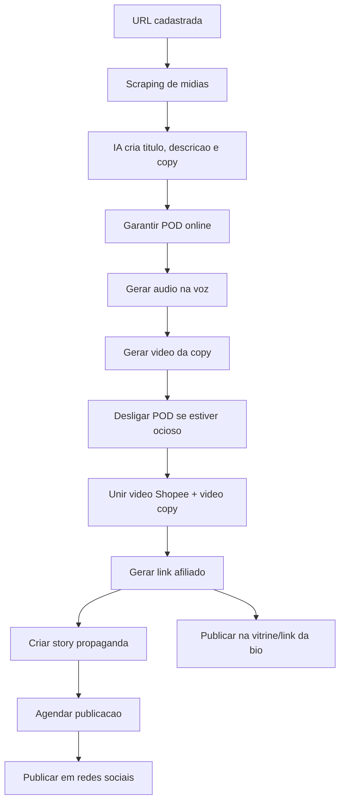

# Spec - Shopee Video Pipeline

## Objetivo

Criar uma esteira orquestrada para transformar uma URL de produto da Shopee em:

- midias coletadas e armazenadas no MinIO;
- titulo, descricao e copy de vendas;
- audio gerado com a voz do usuario;
- video da copy com imagem do usuario;
- video final unindo propaganda original e video da copy;
- link afiliado;
- story propaganda agendado;
- publicacoes em TikTok, YouTube e Instagram;
- produto publicado na vitrine/link da bio.

Esta documentacao nao implementa codigo. Ela define a arquitetura, contratos, estados, logs, telas e ordem de desenvolvimento.

## Principio central

Cada URL da Shopee deve ser tratada como uma unidade de producao.

Ela precisa contar sua propria historia:

- onde entrou;
- em qual etapa esta;
- quais artefatos gerou;
- quais chamadas foram feitas;
- quais retornos recebeu;
- onde falhou;
- quando tentara novamente;
- o que falta para ser publicada.

## Fluxo macro

## Premissas confirmadas no projeto

- Ja existe tela administrativa em `app/(admin)/admin/coleta-shopee/page.tsx`.
- Ja existe rota de scraping por item em `app/api/coleta-shopee/[id]/scrape/route.ts`.
- Ja existe integracao de scraping Shopee no `render-service`.
- Ja existe worker Python com endpoints Shopee em `worker/video.py`.
- Ja existe rotina Shopee afiliados em `app/api/shopee/*`.
- Ja existe cron geral em `app/api/automation/cron/route.ts`.
- Ja existe estrutura de posts sociais e cron social.
- Ja existe pipeline manual/parcial de criacao de video.

## O que esta fora do escopo desta spec inicial

- Implementar codigo de producao.
- Escolher fornecedor definitivo da API de voz.
- Definir credenciais reais de publicacao social.
- Decidir detalhes comerciais finais da vitrine.

