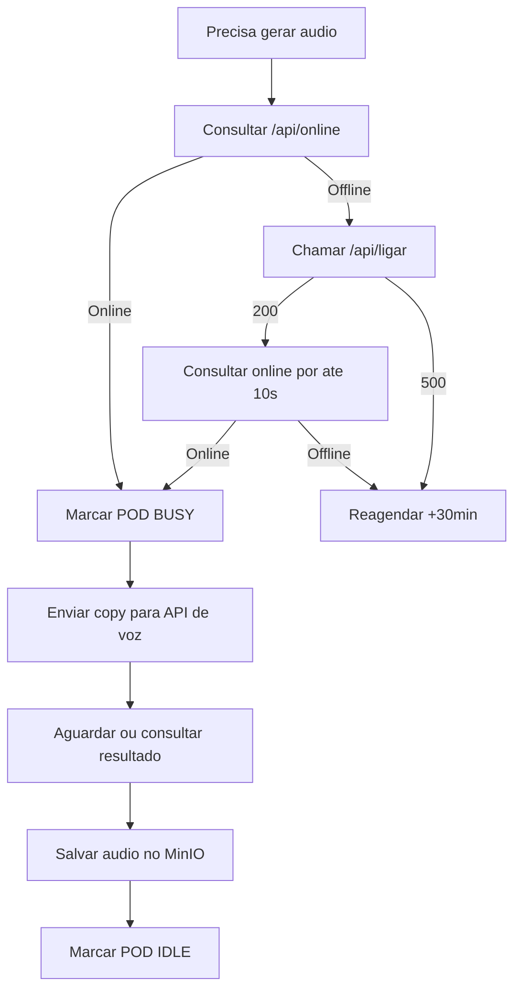

# RunPod, Audio e Video da Copy

## Contexto

A geracao de audio depende de uma API externa que roda em RunPod. O POD pode estar desligado. Como o custo e por hora, o sistema precisa ligar somente quando necessario e desligar quando estiver ocioso.

## Endpoints conhecidos

Base informada:

```txt
https://frontend-ligadesligapod.xclkv8.easypanel.host
```

Endpoints:

- `POST /api/ligar`
- `GET /api/online`
- `POST /api/desligar`

Parametros para ligar:

```json
{
  "esperarOnline": true,
  "maxEsperaSegundos": 10
}
```

## Fluxo recomendado



## Regra de retry do POD

Se o POD estiver offline e nao ligar:

- status do item: `WAITING_POD`;
- etapa: `RETRY_SCHEDULED`;
- `nextRunAt = now + 30 minutes`;
- registrar request e response;
- nao marcar como falha definitiva.

## Desligamento

Nao desligar imediatamente apos cada audio. Recomendacao:

- marcar `pod_sessions.status = IDLE`;
- atualizar `lastActivityAt`;
- `pod-watchdog` aguarda uma janela, por exemplo 5 minutos;
- se nao houver job ativo e fila imediata, chamar `/api/desligar`.

## Criterio de ociosidade

O POD pode ser desligado quando:

- `/api/online` retorna online;
- nao existe `pod_sessions.currentShopeeItemId`;
- nao existe etapa `GENERATING_AUDIO` ou `GENERATING_COPY_VIDEO` em andamento;
- nao existe URL com `nextRunAt <= now` precisando do POD;
- `lastActivityAt` passou da janela minima.

## Geracao de audio

Entrada minima:

- `salesCopy`;
- voz do usuario;
- configuracoes opcionais de velocidade/estilo;
- `shopeeItemId` para rastreabilidade.

Saida esperada:

- URL do audio salvo no MinIO;
- duracao;
- provider job id, se existir;
- payload bruto de retorno.

## Contrato (MVP)

Status:

- OK A geracao de audio roda via ComfyUI (prompt API) com template versionado + placeholders.

Campos usados pelo orquestrador:

- fonte da voz: `ShopeePipelineConfig.userVoiceRefUrl`
- texto: `ColetaDadosShoppe.aiPromptVendas`
- template: `ShopeePipelineConfig.comfyAudioPromptTemplate` (override) ou `lib/shopee-pipeline/comfyui/templates/audio-voiceclone.json`

## Uso do ComfyUI

A geracao de audio e video da copy deve usar ComfyUI rodando dentro do POD.

Documentacao especifica:

- `12-comfyui-workflows.md`

Resumo:

- o workflow de voz (`API-VOZ.json`) ja esta em formato de prompt API do ComfyUI;
- o workflow Infinite Talk (`WORKFLOW - INFINITE TALK.json`) esta em formato visual e precisa ser exportado para formato API antes da automacao;
- o orquestrador deve tratar cada execucao como job assincrono via `/prompt` e `/history/{prompt_id}`;
- os outputs devem ser baixados do ComfyUI e enviados ao MinIO;
- todos os prompts, histories e artefatos devem ser registrados nos logs do pipeline.

## Geracao do video da copy

Entrada minima:

- `audioUrl`;
- imagem do usuario;
- titulo/produto para metadados;
- formato vertical 1080x1920, salvo decisao diferente.

Saida esperada:

- `copyVideoUrl`;
- duracao;
- logs de renderizacao;
- payload bruto de retorno.

## Local da imagem do usuario

Recomendacao:

- armazenar em MinIO;
- manter URL/configuracao em tabela de configuracao do pipeline;
- permitir upload/alteracao por tela administrativa futura.
